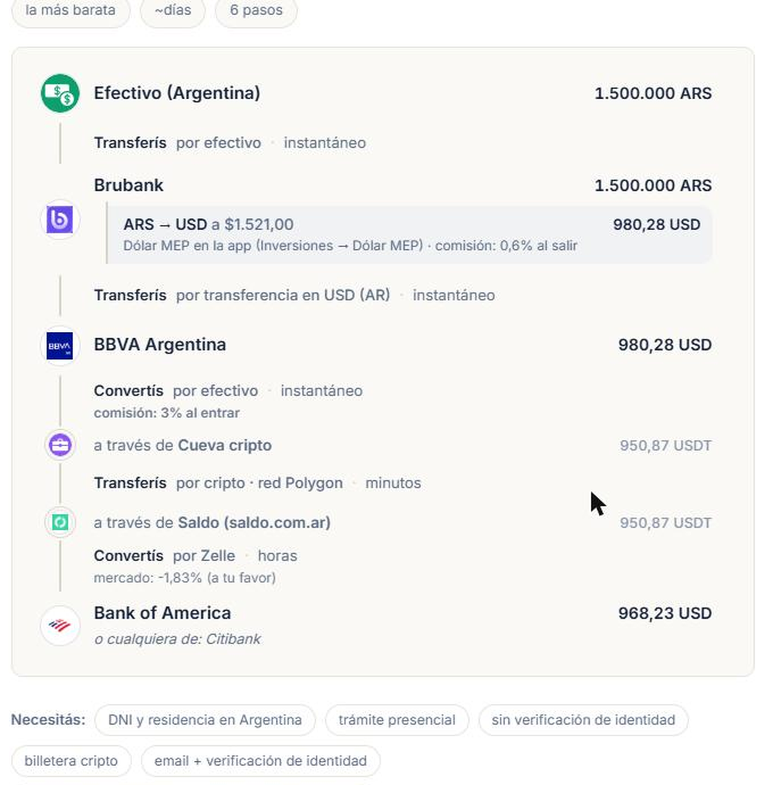
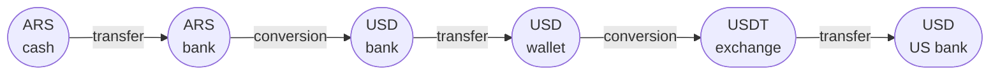
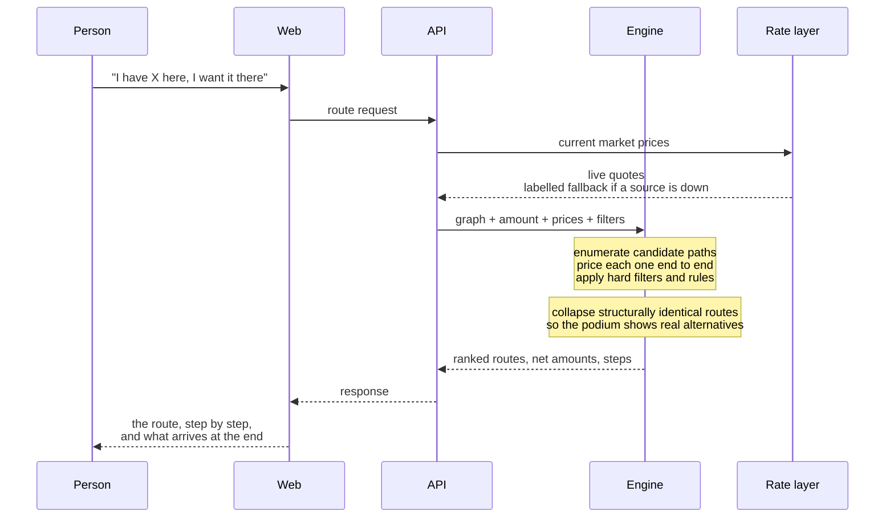

<div align="center">

# ▲ Triangulito

### A routing engine for money

You have funds in one place and want them in another.<br/>
Triangulito finds the path that leaves you with the most.

**[triangulito.com.ar →](https://triangulito.com.ar)**

<sub>Live in production · Non-custodial · Built solo</sub>

</div>

<br/>

> ### The cheapest way to move money from A to B is usually not A to B.
>
> It's a path through C and D. And it's a path no reasonable person finds by hand,
> because finding it means pricing every combination of every platform against a live
> market, for one specific amount, right now.
>
> That's a graph search problem wearing a finance costume.

<br/>

<div align="center">

<br/>
<sub><i>A real answer from the live engine. Six steps, three platforms nobody would have<br/>
guessed, and the total cost stated up front.<br/>
The product is Spanish-first — its users are in Latin America.</i></sub>
</div>

<br/>

**[The problem](#the-problem)** · **[The idea](#the-idea)** · **[Architecture](#architecture)** ·
**[Inside a query](#inside-a-query)** · **[Five decisions](#five-decisions)** ·
**[Correctness](#correctness)** · **[Why there's no code here](#why-theres-no-code-here)**

---

## At a glance

**Connectivity is derived, not written.** Platforms describe themselves; the routes
between them are compiled. Nobody wires a connection by hand.

**No number ranks without proof.** Every value carries the class of evidence behind
it, and weak evidence is structurally forbidden from making a recommendation. Enforced
by the test suite, not by discipline.

**Git is the database.** Curated financial data lives as versioned files — auditable,
diffable, reviewed like code.

**Non-custodial by design.** It never touches, holds or moves funds. That single
constraint keeps the system out of heavy financial regulation and shapes every decision
downstream.

---

## The problem

Moving money between platforms costs money, and almost nobody knows how much.

Someone holding pesos in a wallet who needs dollars in a US account faces a fragmented
landscape: banks, digital banks, fintechs, crypto exchanges, P2P marketplaces,
remittance services, cash desks. Each charges differently.

**Most of them hide the real cost inside the exchange rate**, not in a stated fee. So
the comparison people actually make — whose fee looks smallest — is measuring the wrong
thing.

And the intuitive answer is usually wrong anyway. Going direct is rarely cheapest. The
winning route is typically three to six steps long, crosses platforms that seem
unrelated to the goal, and changes depending on how much you're moving — because a flat
fee and a percentage fee trade places as the amount grows.

Nobody is going to work that out on a notepad.

---

## The idea

Everything rests on one definition.

> **The unit of the system is a *state of money*: a pair of (asset, place).**

"Pesos in a wallet" and "dollars in that same wallet" are different states, even though
it's the same app. "Dollars in a US bank" is another one.

Describe money that way and the whole domain collapses into a graph. States are the
vertices. The operations that move money between them are the edges.



There are exactly two kinds of edge, and the distinction carries real weight:

| | changes | carries a market price |
|---|---|---|
| **Transfer** | the *place* | never |
| **Conversion** | the *asset* | always, resolved live at query time |

That rule is sealed in code. If the asset changes there's a price; if only the place
changes there's never a spread. It makes it structurally impossible for a conversion to
be evaluated without a live source behind it.

**The routing itself isn't the hard part.** Cheapest-path search over a weighted graph
is a solved family of algorithms — the same class a GPS uses to cross a city. The engine
doesn't invent routing. It inherits it.

The hard part is everything that has to be true *before* the search is allowed to run.

---

## Architecture

A compilation pipeline, not a live database. Curated facts live as versioned files; a
build step validates them and derives the executable graph. Each stage consumes the
previous one through an explicit contract — which is what makes them independently
workable.

```mermaid
flowchart TB
    subgraph INGEST["INGEST — the data does not rot"]
        direction LR
        tariffs["Fee schedules<br/>archived and diffed"]
        market["Market rates<br/>live, at query time"]
    end

    subgraph CATALOG["CATALOG — what exists"]
        nodes[("Platform files<br/>one per platform<br/>capabilities declared")]
    end

    subgraph COMPILER["COMPILER — connectivity is derived"]
        build["Graph builder<br/>validate, match, compose costs"]
        graph[("Executable graph")]
        build --> graph
    end

    subgraph ENGINE["ENGINE — the routing"]
        route["Cheapest-path search<br/>amount-aware, filtered, diversified"]
    end

    subgraph PRODUCT["PRODUCT — the surface"]
        api["API"] --> web["Web"]
    end

    GOV["GOVERNANCE — cross-cutting<br/>schema contracts · golden tests · evidence rules · CI"]

    tariffs -->|"flagged for review<br/>a human updates"| nodes
    nodes --> build
    graph --> route
    market -->|"live, per query"| route
    route --> api

    GOV -.-> CATALOG
    GOV -.-> COMPILER
    GOV -.-> ENGINE
```

Two principles carry most of the weight.

### 1. Connectivity is derived, never written

Each platform file describes only that platform: what it can take in, what it can send
out, what it can exchange internally. Edges emerge from matching those descriptions
against each other. A few dozen curated files compile into well over a thousand derived
connections.

This matters more than it sounds. Hand-wiring connectivity is quadratic work that rots
the moment a platform changes a policy. Deriving it means a one-line change to one file
opens or closes every route that depended on it — and the compiler reports exactly which
ones appeared and disappeared.

The human job is describing platforms. The machine's job is working out what that
implies.

### 2. No number without a classified source

Every value carries the class of evidence behind it: where it came from, how directly it
was observed, when. Weak classes are stored but **structurally forbidden from ranking** —
they can inform, never recommend.

This isn't a documentation convention that depends on discipline. It's a contract the
test suite enforces, and a value that can't prove its lineage fails the build.

The reason is simple. A comparison tool's only asset is being right. **One confidently
presented invented number is worse than a missing one.**

---

## Inside a query



Two details in there came from mistakes, not from planning.

**The engine enumerates over 110,000 complete paths to surface three.** That's
a deliberate, currently-accepted cost. The alternative is aggressive pruning, and pruning
a graph whose edges can be *favourable* is genuinely hard: a shortcut that looks worse at
hop three can be the winner at hop five.

**Routes are collapsed by structural shape before ranking.** A podium of three routes
that are the same trip landing at three interchangeable banks is a podium of one. The
collapsed alternatives travel *inside* the winning route instead of being thrown away.

---

## Five decisions

The interesting part of a system like this is rarely the code. It's the moments where two
reasonable options existed and one had to be paid for.

<details>
<summary><b>① A performance test that measures the wrong thing gets deleted</b></summary>

<br/>

The engine got several times slower over a few weeks without a single test complaining.

The obvious fix is a stopwatch in CI: fail the build if a query takes longer than N
seconds. That fix doesn't survive contact with reality. CI runners have variable
performance, so a wall-clock assertion flakes — and a flaky test gets widened until it
means nothing, then disabled.

**What was measured instead: how many candidate paths the engine enumerates.**
Deterministic, identical on every machine, and precisely the quantity that had degraded.
Wall-clock time is still recorded, but only as a loose second-order net for a regression
that *doesn't* move the count.

**The cost:** the count is a golden value that legitimately moves whenever the catalog
grows, so it has to be re-measured and justified in the same commit that moves it.
Widening it to make the build green is explicitly the one forbidden move, and the failure
message says so out loud.

</details>

<details>
<summary><b>② Making it twice as fast without changing a single output</b></summary>

<br/>

Profiling showed the engine recomputing constants millions of times per query — facts
about the catalog that cannot change mid-query were being resolved inside the innermost
loop.

Several memoizations cut query time roughly in half. The scope of each was chosen
carefully: caches over catalog facts live as long as the process, but **caches over market
prices live only as long as a single query**, deliberately. A cache that outlives the
query eventually serves yesterday's exchange rate with today's confidence.

**Verification was the whole point.** Every route on every podium across a set of
representative corridors was compared to the pre-change output *at full decimal
precision*. Not "the tests pass" — identical results. An optimization that changes an
answer isn't an optimization, it's a bug with a good excuse.

</details>

<details>
<summary><b>③ Deleting a safety guard because it was flipping a coin</b></summary>

<br/>

The engine carried a rule meant to prevent a class of nonsensical route. It had been
there a long time and felt load-bearing.

Then it got measured. The rule inspected the *label* of the asset and never *where the
asset was* — so it pruned a route and let its identical twin through, purely because one
leg passed through a platform whose balance happened to be labelled differently. It
wasn't preventing anything. It was rejecting half the cases at random.

Worse, its implementation put a ceiling on the search that could make the engine stop
looking for the best route and start looking for the one closest to the ceiling.

**It was deleted entirely**, and replaced with a constraint that's actually true: a path
never revisits a state it has already occupied.

**The cost was real and accepted in writing.** Removing the guard makes one specific
pathological route rankable rather than hidden. The judgement that catches it moved
*earlier* — into data curation, before the number is ever loaded — because a contradiction
in the data is better caught by a human reading two prices than by an engine trying to
reason its way out of it. The test that pins this behaviour is named after the trade-off,
so nobody "fixes" it by accident.

</details>

<details>
<summary><b>④ Building a caching layer, proving it works, then turning it off</b></summary>

<br/>

Answering a query live costs seconds of CPU. Every possible answer can be precomputed and
served from a compiled artifact in milliseconds, with zero outbound calls. It was built,
tested, locked behind its own guards, and shipped.

**It runs disabled.** Precomputation trades freshness for cost, and for a tool whose
entire value proposition is being right *now*, that trade goes the wrong way. Serving a
stale podium quickly is worse than serving a fresh one slowly.

It stays in the codebase, fully tested, with the invariants that make it safe documented
as untouchable — including the hardest-won one: if the compiled artifact doesn't
correspond to the graph currently loaded, **the process refuses to start**. A service
that's down is infinitely better than a service confidently serving routes that no longer
exist.

The decision is reversible in four steps, three of which aren't code. That's the point of
writing it down.

</details>

<details>
<summary><b>⑤ The modelling flaw that three unrelated bugs were pointing at</b></summary>

<br/>

Three problems surfaced over several months: a guard that pruned by label, a category of
real and measured connection that couldn't be expressed in the schema at all, and a search
space that resists pruning.

They turned out to be the same bug.

The catalog treats a dollar in a wallet and a dollar in a bank as **the same asset** — and
the market plainly disagrees, because there's a liquid two-sided market pricing exactly
that difference.

The fix isn't local. Splitting the asset by location touches the schema, the compiler, the
engine and every golden test at once. It's sequenced as explicit ordered stages rather
than attempted in one go, and the ordering is itself a decision: the protective test lock
goes in *first*, so the risky work happens with a net underneath it.

**The lesson worth keeping:** three bugs that look unrelated and resist independent fixes
are usually one modelling error wearing three costumes. The tell was that every fix kept
requiring an exception.

</details>

---

## Correctness

A comparison tool that's occasionally wrong is worse than no tool. So correctness is
treated as the primary feature, not a quality-of-life concern.

**Git is the database.** Curated data lives as versioned files — auditable, diffable,
reviewed like code. Nothing is a row someone changed on a Tuesday with no record of why.

**Golden tests, pinned to a frozen market.** The whole suite runs fully offline against
dated fixtures. Testing a financial engine against live prices means numbers move for
reasons that aren't the change under test, and a suite that cries wolf gets ignored.

**Hard rules are code, not memory.** Every constraint that matters exists as a test that
fails — evidence-class enforcement, the conversion/price rule, even repository structure
conventions. Rules that live only in documentation erode.

**Tuning knobs live in configuration, read at runtime**, each with a written note on what
it is, when it was calibrated, against what, and why. Recalibrating a threshold doesn't
touch engine code or require a redeploy.

**Automated freshness checks** flag when an external source changes or goes stale, so a
fee schedule that quietly moved becomes a notification instead of a silently wrong answer
six months later.

**CI on every push** — schema contracts, graph compilation, engine goldens, extractors,
internal tooling, the API surface, and end-to-end browser tests.

The public surface is hardened behind a single switch, with an automated suite that
verifies the deployed site against real HTTP after every release. Details of that layer
are deliberately not documented here.

---

## Status

**Live in production, in active development.**

Working today: the compiled graph across a curated catalog of banks, digital banks,
wallets, crypto exchanges, P2P venues, remittance services and cash desks; live market
pricing with labelled fallback; the routing engine with hard filters and podium
diversification; the public API; and the web front end with step-by-step route display.

In progress: modelling money states more finely by location, pruning the search space,
expanding the catalog beyond the first corridor, and a visual identity pass.

**Deliberately unresolved: monetization.** The architecture keeps any future commercial
layer structurally isolated from ranking — a sponsored placement can never influence which
route wins. That property was designed in from the start rather than promised later,
because it's impossible to add credibly after the fact.

---

## Why there's no code here

**This repository contains no source code, and that's intentional.**

The value of Triangulito isn't the routing algorithm. Cheapest-path search is textbook
material, freely available, and I didn't invent it.

The value is the **connectivity map**: which transfer is actually possible between which
platforms, under which country, at which verification level, at what real cost. That map
doesn't exist in any public API. It was built by investigation, one platform at a time,
and it's the part that's hard to copy.

So this document describes the problem, the shape of the solution, and the reasoning
behind the trade-offs — all of which are transferable and worth discussing. It doesn't
describe the data, the schema, or the calibrated values, all of which are the product.

Happy to walk through the internals in a conversation.

<br/>

<div align="center">

### [▲ Try it — triangulito.com.ar](https://triangulito.com.ar)

Try it and tell me what you think.

[LinkedIn](https://www.linkedin.com/in/m%C3%A1ximo-sckell-02a42b233) · maximosck@gmail.com · [@msckell](https://github.com/msckell)

<br/>

<sub>Built using frontier AI tools — Claude, Gemini and ChatGPT.</sub><br/>
<sub>Informational and non-custodial: Triangulito does not touch, hold or move funds.<br/>
Figures are estimates with a source and a date; market conditions change. Not financial advice.</sub>

</div>
